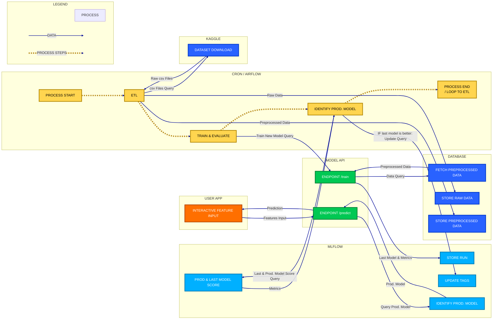

# 🚗 Road accidents in France

The objective of this MLOps project is to build a MLOps pipeline with the aim of predicting the severity of road accidents in France. Predictions will be based on historical data.

## ↪️ Architecture Overview

<!-- Mermaid.js script copied from the most up to date version in src/utils/schemas.py -->


## 🗂️ Project Organization

The project is structured as follows:
    ├── README.md          <- The top-level README for developers using this project.
    ├── data
    │   ├── external       <- Data from third party sources.
    │   ├── interim        <- Intermediate data that has been transformed.
    │   ├── processed      <- The final, canonical data sets for modeling.
    │   └── raw            <- The original, immutable data dump.
    │
    ├── logs               <- Logs from training and predicting
    │
    ├── models             <- Trained and serialized models, model predictions, or model summaries
    │
    ├── notebooks          <- Jupyter notebooks. Naming convention is a number (for ordering),
    │                         the creator's initials, and a short `-` delimited description, e.g.
    │                         `1.0-jqp-initial-data-exploration`.
    │
    ├── references         <- Data dictionaries, manuals, and all other explanatory materials.
    │
    ├── src                <- Source code for use in this project.
    │   ├── __init__.py    <- Makes src a Python module
    │   │
    │   ├── data           <- Scripts to download or generate data
    │   │
    │   ├── features       <- Scripts to turn raw data into features for modeling
    │   │
    │   ├── models         <- Scripts to train models and then use trained models to make
    │   │                     predictions
    │   │
    │   └── config         <- Describe the parameters used in train_model.py and predict_model.py

## 🚀 Quick start

1. Clone this repository and move into the project root.
2. Create a `.env` file in the root directory (you can start from `.env.example`).
3. Create a virtual environment and install dependencies (see the "⚙️ Setup" section below):
   ```bash
   uv venv create .venv
   uv sync

## ⚙️ Setup

1. Install Python 3.11 or higher.
2. Install `uv` package manager from [uv package manager](https://uv.dev/).
3. Set up an environment variables file `.env` in the root directory (e.g., see `.env.example`).
3. Create a virtual environment:
   ```bash
   uv venv create .venv
   ```
4. Install dependencies:
   ```bash
   uv sync
   ```
5. Create and update environment variables in `.env` file as needed (see `.env.example`).

## ⌨️ Development

1. Activate the environment:
   ```bash
   source .venv/bin/activate
   ```
2. Run the FastAPI application:
   ```bash
   make api_dev
    ```
3. Access the API documentation at `http://localhost:8000/docs` (find e.g. the API key in the `.env` file, set it via the "Authorize" button in the Swagger UI).

## 📊 Data Ingestion

This project supports two modes of data ingestion:

### Full Batch Loading
Load all data at once using the traditional ETL process:
```bash
make do_etl
```

### Chunked/Incremental Loading
Load data in chunks to simulate data evolution over time. This is useful for testing incremental model training and monitoring data arrival patterns.

- **Using Makefile:**
```bash
make ingest_data_chunked
```
- **Using the script directly:**
```bash
python -m src.data.ingest_data --mode chunked --chunk-size 10000
```
- **Using the API:**

1. Start the API server:
   ```bash
   make api_dev
   ```

2. Check ingestion progress:
   ```bash
   curl -H "X-API-Key: YOUR_API_KEY" "http://localhost:8000/data/progress"
   ```

## 🧼 Data Cleaning

Data cleaning is performed during the transformation step. To run data transformation, use:
```bash
make clean_data
```
Internally, SCD Type 2 logic is applied to maintain historical records of changes in the data.

## 🪈 ETL Pipeline

The ETL pipeline can be executed using the following commands:

```bash
make do_etl_full  # Ingest full data
make do_etl_chunked  # Ingest next data chunk
```

## 🤖 Model Training

The project implements a Random Forest Classifier for predicting accident severity. The training pipeline uses a **static validation dataset** approach for consistent model evaluation.

### Quick Start

1. **Assign dataset splits** (one-time setup):
   ```bash
   make assign_splits
   ```

2. **Train the model**:
   ```bash
   make train_model
   ```

3. **Or run the complete ML pipeline**:
   ```bash
   make do_ml_pipeline  # Runs: clean_data → assign_splits → train_model
   ```

### Validation Strategy

- **Static train/validation/test splits**: 60% / 20% / 20%
- **Stratified sampling**: Ensures balanced class distribution
- **Database-tracked**: Split assignments stored in `clean_data.dataset_split` column
- **Reproducible**: Fixed random seed (42) for consistent splits

### Model & Metrics

- **Model**: Random Forest Classifier with 100 trees
- **Metrics**: Accuracy, Precision, Recall, F1-score (weighted), ROC-AUC
- **Artifacts**: Model, metrics, feature importance, confusion matrix, config


## Streamlit Presentation

1. **Start the API locally with:**
   ```bash
   uvicorn src.api.main:app --reload
   ```

2. **Start the Streamlit App locally with:**
   ```bash
   PYTHONPATH=. streamlit run src/streamlit/streamlit_app.py
   ```
3. **The Streamlit App can be accessed at:\n**
   http://localhost:8501/